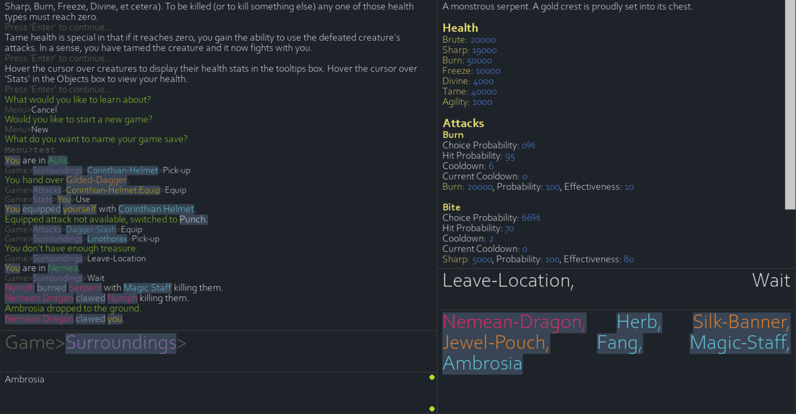

# Odyssey Greek Mythology Text Adventure

## Motive

My brother and I made this game for an english project in high school. He researched and wrote all the game_objects in the default_configs file (which, as a result, contains a considerable amount of content). I wrote most of the code. The majority of the code in the core directory I had already created before starting the english project, but everything else (initially) I wrote in about a week. We did make a few improvements after the week was over and we had already turned in the project. We later added a ton more content and features and resubmitted the game for a subsequent english project. Much later we finished a few todos and fixed a number of bugs. This repository contains the latest content/code.  
  
## Explanation

For the first project, the theme was simply Greek Mythology. So most of the content is centered around this theme. The second project's theme was Beowulf/Cantebury Tales. As a result, there is also a substantial amount of content centering on these themes. Oh, and a lot of the content was never finished despite being implemented. As a result, many enemies and items have no actual purpose/use except to look cool.  
  
## Quick Walkthrough

A lot of the features are explained in the in-game tutorials. However, these are not the most up-to-date so a few things may be a bit confusing. I'll try to clear some things up.  
  
**Controls**  
When presented with choices in the two boxes on the bottom right of the screen, you can simply click whatever choice suits you. If you'd prefer, you can type out the choice and hit the return key. Typing is restricted to whatever choices are currently presented. You can also use tab and shift+tab to cycle between choices which match whatever you have already typed-in.  
  
Highlighted text will display a tooltip when hovered by the cursor.  
  
This game uses a path system to select actions and view information. You can click choices to move through the path. The path is displayed above the input box on the left side of the screen. You can click on objects in the path to move back to them. You can also press backspace when nothing has been entered in the input-box to move back through the path.  
  
A more in-depth tutorial on this is available in-game.  
  
**General Gameplay**  
The goal is to survive as long as possible. To do this, it is important to ensure none of your health stats drop below zero. You can view your health by hovering your cursor over 'Stats' on the main menu. Enemies and items can be viewed in the 'Surroundings' menu. To kill and enemy, one of its health stats must be dropped below zero. You can do this by selecting an enemy and choosing 'Attack'. Attacks can be equipped in the 'Attacks' menu. Available attacks are based on the items in your inventory and on attacks you have gained through using items, taming enemies, and various other methods along with the attacks with which you spawned.
  
## Disclaimer

While I am proud of most of the code, I had a very short window in which to write it. This means there are a few places that are quite messy. In fact, the GameObjects and GameActions and path system that make up most of how the game works turns out to have been a pretty bad idea. It quickly became very difficult to update information after it had already been displayed in the game. Anyway, I know a lot more about seperation of concerns and how to humanely structure a project nowadays.
